# TP Bachelor 3 : Programmation embarquée

## Introduction
Une RPI (Rasberry Pi) est un petit ordinateur conçu pour l’apprentissage de la programmation et des bases informatiques. Elle dispose d’un processeur, d’une mémoire vive (RAM = Random Access Memory), d’un espace de stockage (via une micro_sd), ainsi que de ports USB, HDMI et d’une connectivité réseau.  

La Raspberry Pi peut interagir avec des capteurs, des moteurs ou d’autres composants grâce aux broches GPIO (General Purpose Input/output). Cela en fait d’elle un outil très pratique et adapté pour les projets LoT (Internet of Things) et les systèmes embarqués. 

Pour pouvoir établir une connexion avec la RPI, on utilise le SSH (Secure Shell), c’est un protocole de communication qui permet de se connecter à un autre ordinateur via le réseau. Il nous fournit une interface en ligne de commande à travers laquelle on peut exécuter des instructions, transférer des fichiers ou administrer un système, comme si on travaillait dessus directement. Dons nous l’utiliserons pour pouvoir se connecter à notre Raspberry via notre ordinateur. 

Pour cela, nous allons utiliser l’extension Remote-ssh de VS code qui nous permettra d’établir cette connexion et ouvrira, donc, directement un espace de développement sur la Raspberry. Le code python qui sera écrit dans cet espace sera automatiquement enregistré et exécuté sur celle-ci.  

### Objectifs

Configurer une Raspberry Pi Zero en utilisant la liaison UART. 

* Une Raspberry Pi Zero posséde un port 40 pins appelés GPIO, donc nous utiliseront les pins 14 et 15 pour y connecter un bridge USB-UART pour communiquer avec notre pc en UART.

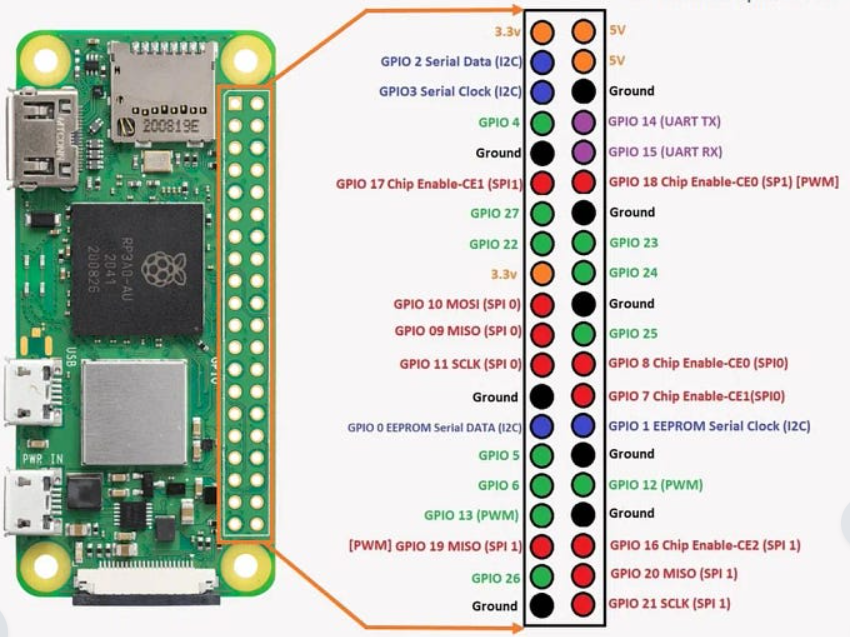

Ecrire un driver proprement

* Un driver sert d'interface entre le logiciel et le matériel, traduit les instructions du programme (python par exemple) en signaux compréhensible par le capteur. Dans notre contexte le dirver sera un fichier python.

Développement d'un programme d'un suiveur de ligne sur VS code.

Développement d'un programme d'un moteur.

Développement d'un programme d'un accéléromètre.

## TP 1
### objectif
* Configurer la Raspberry Pi Zero
* Un tutoriel pas a pas est mis en place pour vous aider à installer les fichiers de l'OS qui sont nécessaires au bon fonctionnement de la Raspberry Pi : 
    
     1. Flasher la carte SD 
     2. Activer la liaison UART
     3. Configurer la connexion 
     4. Se connecter en ssh via le Wifi
     5. Sécuriser la connexion ssh avec une clé 

#### Flasher la carte SD
Allez sur https://www.raspberrypi.com/software/ et installez la Raspberry selon votre type de PC (Winodws, MacOS).

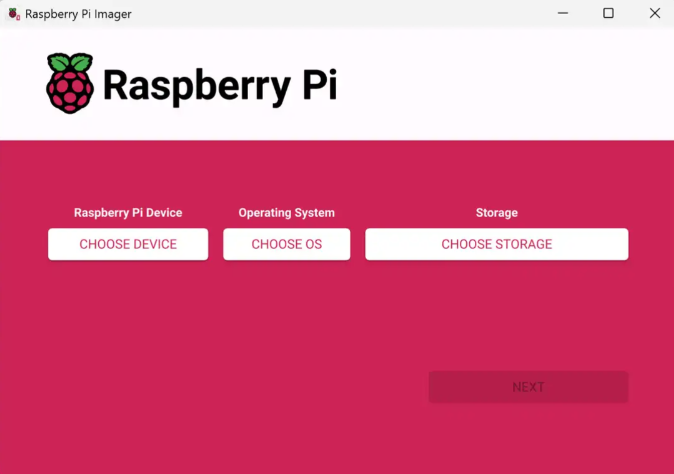

Sélectionnez le bon modèle de RPI : Raspberry Pi Zero 2W

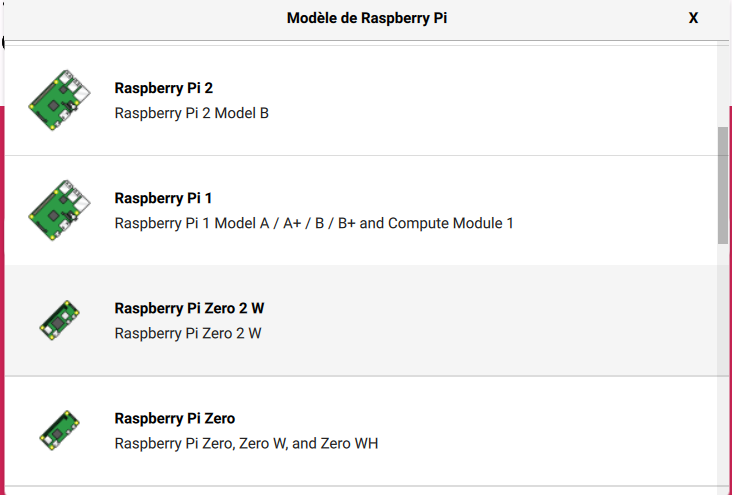

Sélectionnez l'OS adapté à notre utilisation : Raspberry Pi (other) -> L'OS Lite (32-bit)

Sélectionnez le support d'installation de l'OS, sélectionnez la carte SD 

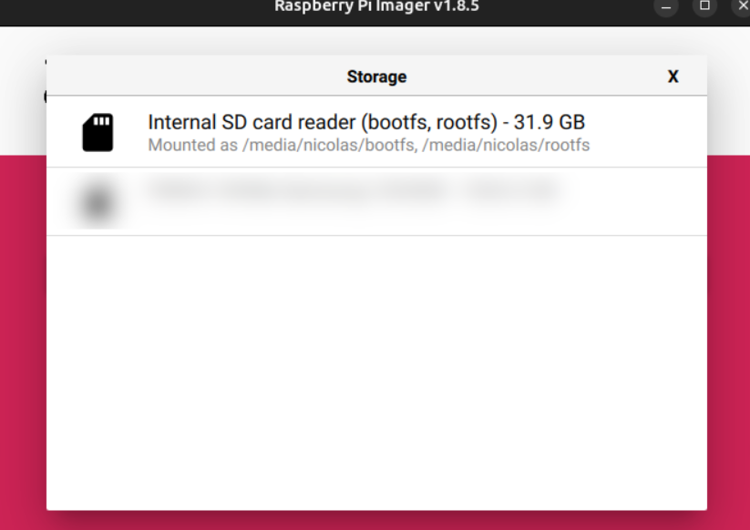

Validez la configuration, la carte SD est prête à être flachée. Cliquez sur Next et choisissez "Edit settings" 

Modifiez quelques paramètres :
* Le hostname -> Choisir la forme "nom de la salle-tes initiales-initiales du binôme"
* nom d'utilisateur et un mot de passe (le mot de passe sera nécessaire à chaque fois donc à retenir)

Validez les modifications apportées et les appliquer a l'installation. 
Validez la copie de l'image de l'OS Linux sur la carte SD.

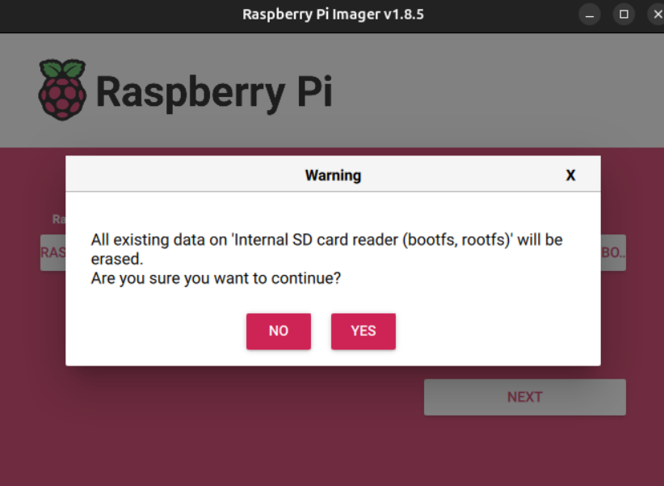

Le processus dure quelques minutes, la fichiers sont copiés et une vérifications de la copie a lieu.

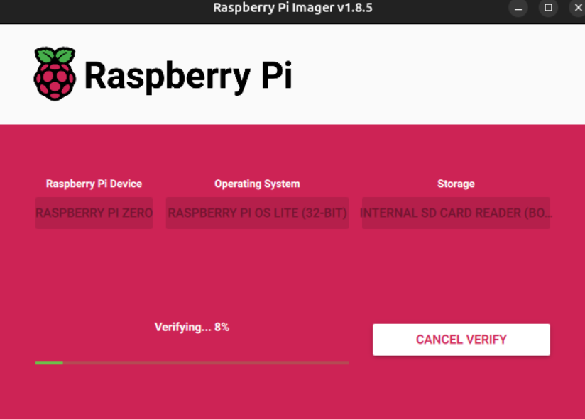

une fois fini, retirez la carte SD et réinsérez la carte SD flachée. Ensuite, éjectez la carte SD en toute sécrité puis insérez la dans la Raspberry Pi.

Assurez vous que la Raspberry est bien allumée et connectée au réseau WIfi. 

Appuyez sur "Windows + R" et tapez "cmd" puis "Entrée"

Tapez, ensuite, "ipconfig"

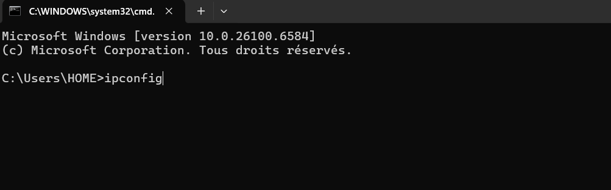

cherchez la section correspendant au réseau Wifi appelée "carte réseau sans fil Wifi" 

Regardez la ligne "Passerelle par défaut..... : 'adresse ip'"
c'est l'adresse IP du routeur.

Allez sur internet et tapez sur la barre de recherche "http://192.168.65.1/#IP:DHCP_Server.Leases" en remplacant"192.168.65.1" par l'adresse IP de votre Wifi.

Regardez l'adresse IP de la Raspberry et la copier.

Ouvrez le terminal et tapez "ping 'adresse IP' "

si vous avez les mêmes réponses affichées à l'écran, ça veut dire que votre PC voit votre Raspberry sur le réseau donc la connection réseau fonctionne. (pour l'arrêter, tapez : "ctrl + C")

tapez "sudo systemctl status ssh"

Si vous voyez "active (running)" alors le SSH est déjà activé. 

Tapez "ssh user@adresse IP". Il vous demandera votre mot de passe (rien ne sera aficher pendant que vous écrirez, c'est normal)

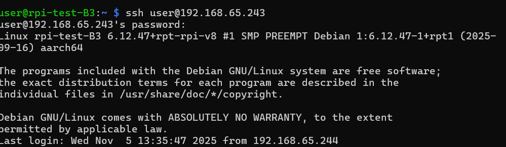

S'il y a bien écrit "Linux rpi-test-B3 ...
Last login: Wed Nov  5 ..." alors vous êtes bien connecté à votre Rasberry via le SSH.

Allez sur VS code et cliquez sur le petit symbole en bleu en bas à gauche de l'écran.

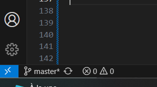

Cliquez sur "Connect to host"

Mettez "votre nom d'utilisateur@l'adresse IP"

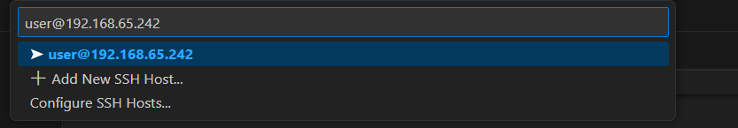

Il vous demandera sur quelle platefrome vous êtes (Linux, Windows ou MacOS), vous mettez "Linux"

Entrez votre mot de passe.
Revenez sur votre terminal et marquez "mkdir 'nom de votre dossier'" ensuite "cd 'nom de votre dossier'". Le dossier est créer, puis vous tapez "ls" puis "cd..".

Revenez sur VS code et ouvrez le dossier, créez, ensuite, 3 fichier "main.py" "MCP3208.py" et "votre composant.py" 

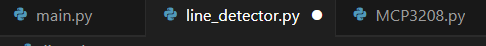 

Maintenant il faudra rédiger un code dans les 3 onglets et les reliés ensemble pour que le code puisse fonctionner. 

## TP 2

### Objectifs

* Rédiger le code pour le moteur
  
#### Structure du code
créez trois fichiers python "main.py", et par exemple "config.py" et "driver.py".

Chacun a un rôle bien défini :
  
* main.py -> programme principale, initialise et teste le moteur.
* config.py -> contient les constantes tels que les pins, direction, vitesse...
* driver.py -> contient la logique pour faire bouger le moteur

#### Driver.py
Ce fichier est le coeur du code, contrôle le moteur via les GPIO.

Pour commencer, importez RPI.GPIO et time :

* RPI.GPIO : bibliothéque pour contrôler les broches GPIO de la Raspberry Pi.
* time : permet de faire des pauses entre les impulsions envoyées au moteur.

Importez les constantes de config.py.

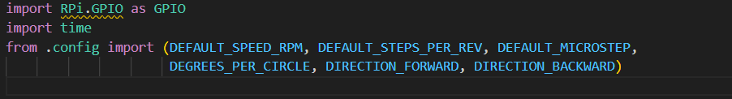

Créez une class TMC2225 (nom du driver du moteur)
puis vous initialisez les broches et configurez les comme sorties, puis configurez la vitesse et la direction initiale.

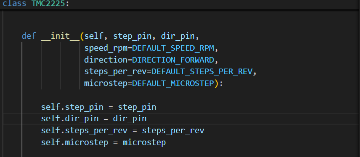

Définissez un "set_speed" pour convertir la vitesse en fréquence d'impulsions (Hz) (plus la fréquence est élevée, plus le moteur tourne vite) 

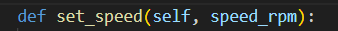

Définissez un "set_direction" pour définir le sens de rotation du moteur (avant/arriére)

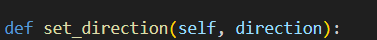

Définissez un "step" pour effectuer un nombre de pas donné, il permet d'envoyer des impulsions carrées au driver du moteur.

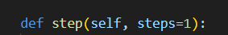

Définissez "rotate" pour faire tourner le moteur d'un angle en degrés, cette fonction permet de calculer combien de pas correspondent à un angle donné (en degrés)

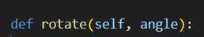

définissez "info" pour afficher les informations du moteur, la fonction peut servir à afficher les valeurs actuelles des paramètres du moteurs.

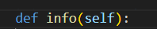

Enfin, définissez un "cleanup" pour nettoyer les GPIO du moteur, il permet de les libérer pour éviter les problémes.

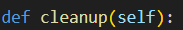

#### main.py
Ce fichier initialise, affiche les informations et teste la rotation du moteur. C'est le programme d'exécution.

Pour commencer, importez TMC2225 et time aisni que les constantes de motor.config.

* TMC2225 : Contient les fonctions pour piloter le moteur.
* motor.config : Variables qui définissent les numéros des pins GPIO, la vitesse en RPM et la direction initiale (avant/arriére)
  
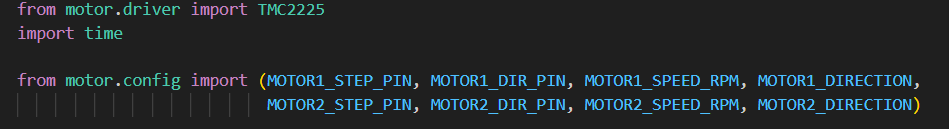

Exécutez le code seulement si le fichier est lancé directement, pas importé par un autre fichier.

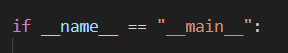

Définissez les paramètres du test pour modifier le test facilement sans toucher au code du moteur.

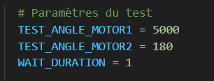

Créez 2 objets moteur pour initialiser des moteurs à partir de la configuration, et les afficher.

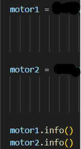

Exécutez le test avec la variables, utilisez la méthode rotate(angle) pour convertir l'angle en un nombre de pas moteurs et les exécuter ensuite.

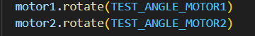

Mettez une pause avec "time.sleep"

Nettoyez les GPIO avec la fonction "cleanup"

#### config.py

Mettre toutes les constantes dont nous avons besoin.

## TP 4
### Objectifs

* Rédige le code pour le suiveur de ligne.

#### Structure du code

créez trois fichiers python "main.py", et par exemple "line_detector.py" et "MCP3208.py".

Chacun a un rôle bien défini :

main.py -> programme principale, fait tourner le capteur de suivi de ligne.
line_detector.py -> Lit les capteurs et détecte la ligne.
MCP3208.py -> contient les informations pour lire les capteurs IR, analyser les valeurs, afficher les valeurs des capteurs.

#### MCP3208.py

Pour commencer, importez "spidev" pour communiquer avec les périphériques SPI sur la Rasberry Pi.

Utilisez des constantes pour construire la commande à envoyer à l'ADC.

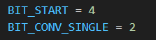

Créez une classe MCP3208 pour initialiser l'ADC avec les paramétres "spi_bus", "spi_device", "clock_speed" et "vref".
* spi_bus, spi_device : numéro du bus et du périphérique SPI -> ouvre la communication SPI avec le bus et le périphérique spécifiés.
* clock_speed : vitesse SPI -> définit la vitesse max de la communication SPI.
* vref : tension de référence -> sauvegarde la tension de référence dans l'objet, pour convertir les valeurs ADC en tension.

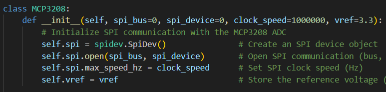

Définissez une méthode pour lire la valeur brute et vérifiez si le numéro du canal est visible sinon il souléve l'erreur.

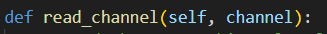

Construisez une commande SPI pour le MCP3208. Ensuite Envoyez la commande pour reçevoir la réponse de 3octets de l'ADC. Convertir le résultat ADC 12 bits à partir des octets de réponse et enfin retournez la valeur.

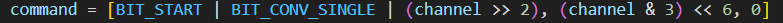

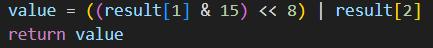

Définissez une méthode pour lire la tension réelle d'un canal.

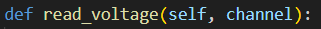

Définissez une méthode pour lire tous les 8 canaux en tension et retourner une liste de 8 valeurs.

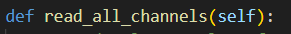

Fermez proprement la communication SPI pour libérer le périphérique et éviter les erreurs.

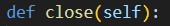

#### line_detector.py

Importez MCP3208 et time.

* MCP3208 : Communiquer avec l'ADC.
* time : marquer des pauses de lectures.

Mettre un seuil de tension pour déterminer si le capteur détecte la ligne.

Définissez une fonction pour lire les 8 capteurs et détecter la position de la ligne.

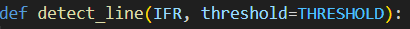

Lisez les tensions de chaque capteurs connecté aux 8 canaux de l'ADC, et affichez les valeurs en 2 décimales pour monitoring (=surveillance).

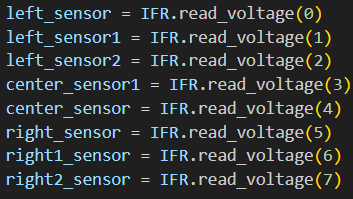

Mettez une logique de base pour suivre la ligne, c'est à dire comparez chaque tension à "threshold" (=seuil pour détecter la ligne).

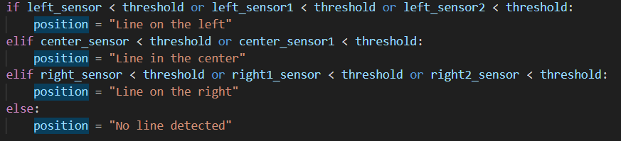

Enfin affichez la position détectée à côté des tension des capteurs, marquez une pause pour éviter de saturer le CPU (=microprocesseur) et la console et renvoyez la position détectée afin que le programme principal "main.py" puisse l'utliser.

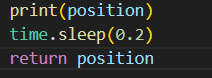

#### main.py

Importez MCP3208, detect_line et time.

* MCP3208 : Communiquer avec l'ADC.
* detect_line : lire les capteurs et détecter la position de la ligne.
* time : Introduire des délais

Mettez les constantes"THRESHOLD" et "DELAY".

Définissez la fonction principale qui contient la boucle principale du suiveur de ligne.

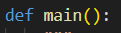

Initialisez l'ADC MCP3208 avec la tension de référence et utilisez "IFR" pour lire les capteurs via SPI.

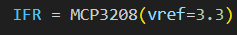

Affichez un message indiquant que le suiveur de ligne commence à suivre la ligne en l'incluant dans un bloc "try" qui permet de gérer les interruptions et les erreurs proprement.

mettez une boucle principale pour lire les capteurs en continue.

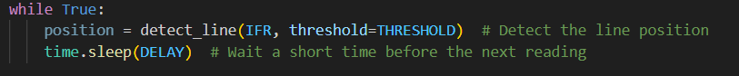

Mettez une gestion de lt'interrupteur clavier, si l'utilisateur appuie sur "ctrl+C" le programme se ferme correctement la communication SPI.

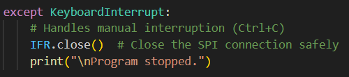

Mettez une gestion pour les autres erreurs, si une erreur inattendue survient alors la communication SPI se ferme pour ne pas bloquer le périphérique et affiche l'erreur pour le debug.

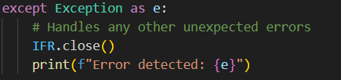

Enfin, mettez une exécution conditionnelle pour vérifier que le fichier est exécuté directement et si oui, alors il appelle "main()" pour démarrer le programme.

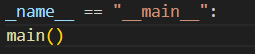

## TP 5
### Objectifs

* Rédige le code pour l'accéléromètre en i2C.

#### Structure du code

créez trois fichiers python "main.py", et par exemple "setting.py" et "drv_lsm6dsow.py".

Chacun a un rôle bien défini :

main.py -> programme principale, utilise le driver pour afficher les valeurs physiques du capteurs.
setting.py -> définit toutes les constantes nécessaires pour configurer et comprendre le capteur LSM6DSOX.
drv_lsm6dsow.py -> gére la comunication i2C et fournit des fonctions permettant de lire le capteur.

#### setting.py

Déclarez l'adresse i2C du capteur LSM6DSOX avec une valeur hex pour pouvoir parler au capteur sur le bus i2C.

Indiquez le numéro du bus i2C à utiliser (1 pour la Rasberry Pi) mais aussi le nombre d'octets à lire pour chaque bloc de données.

Mettez des constantes pour configurer la fréquence d'échantillonnage de l'accéléromètre dans les registres du capteur.

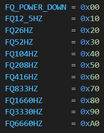

Configurez la plage de l'accéléromètreavec des constantes qui se combineront avec le ODR (=fréquence d'échantillonnage).

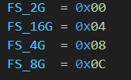

Faites la même chose pour le gyroscope.

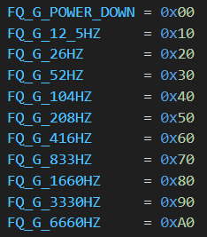

Configurez la plage augulaire du gyroscope pour définir la sensibilité et affecter le facteur de conversion des valeurs brutes.

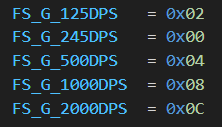

Mettez des constantes pour représenter, chacune, un bit pour configurer des fonctions globales : reboot, BDU (block data update), auto-incrément d'adresse, reset logiciel, mode SPI, type d'IRQ, etc.

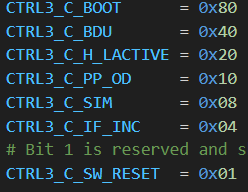

Mettez un délai (en secondes) entre é lectures de capteur.

Configurez des facteurs d'échelle pour convertir les valeurs brutes (LSB) de l'accéléromètre en g (accélération gravitationnelle).

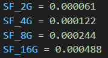

Faites la même chose pour le gyroscope mais convertissez les valeurs en degrés par seconde (dps).

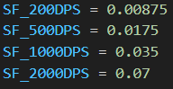

#### drv_lsm6dsow.py

D'abord importez smbus2, time et setting.

* smbus2 : fournit les fonctions i2C pour Rasberry Pi.
* time : Introduire des pauses.
* from setting inmport * importe toutes les constantes définies dans le setting

Commencez par mettre les constantes importantes qui représentent les adresses des registres du LSM6DSOX.

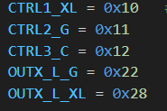

Définissez une class drv_lsm6dsow pour initialiser les paramètres "bus=i2Cbus" et "adresse=LSM6DSOX"
* bus=i2Cbus : pour ouvrir le bus i2C
* adresse=LSM6DSOX : mémoriser l'adresse i2C du capteur (0x6A ou 0x6B).

Initialisez le capteur lsm6dsox pour configurer le capteru en écrivant dans ses registres via i2C, écrire dans CTRL1_XL un octet combinant la fréquence et la plage pour l'accéléromètre mais aussi faire la même chose pour le gyroscope, activer BDU et IF_INC pour permettre la lecture séquentielle de plusieurs registres en un seul bloc.

Définissez une fonction lire l'accéléromètre pour lire les octets à partir d"un registre définit, lire un bloc d'octets, combiner l'octet de poids fort et l'octet de poids faible pour reconstituer chaque axe et enfin pour renvoyer les valeurs brutes. 

Définissez une fonction pour lire le gyroscope pour faire les mêmes choses que pour l'accéléromètre.

Définissez une fonction pour convertir un entier non signé en entier signé selon la représentation en deux-complement.

#### main.py

Commencez par importer drv_lsm6dsow, setting et math
* from drv_lsm6dsow import * : importe tout le driver etudié juste avant.
* from setting import * : importer toutes les constantes.
* math : nécessaire pour utiliser "atan2()" et "degrees()"

Mettez un bloc principale qui s'exécute uniquement si le fichier est lancé directement et non lorsqu'il est importé dans un autre module.

Créez un objet driver qui va communiquer avec le capteur LSM6DSOX via i2C, le constructeur appellera automatiquement init_lsm6dox. Puis affichez un message indiquant que les mesures vont démarrer.

Configurez une boucle principale pour lire en continue.

Lisez les données du capteur pour renvoyer les valeurs brutes de l'accéléromètre et du gyroscope.

Calculez les angles sur X et Y. 
* Convertir les valeurs brutes en g.
* Calculer l'angle entre 2 axes stables.
* Convertir en degrés.

Affichez les données converties, accéléromètre en g et gyroscope en dps.
Affichez aussi les angles calculésen format 2 décimales + symbole °.

Marquez une pause pour laisser le capteur générer de nouvelles mesures.

### Livrable

#### Objectifs du TP

A la fin de ce TP, les étudiants doivent être capables de :
* Configurer une Rasberry Pi. 
* Comprendre et utiliser les bus de communication. 
* Lire et interpréter des capteurs.
* Analyser un code python existant.
* Obtenir des résultats concrets.

#### Résultats attendus

Les étudiants doivent fournir comme résultats :
* Capteurs IR + MCP3208 :
  * Lecture des 8 valeurs de tension.
  * Détection fonctionelle de la position de la ligne.
  * Compréhension et justification de l'usage de seuil de détection.
* Driver moteur :
  * Initialisation correcte du driver moteur.
  * Utilisation des fonctions fournies (setSpeed(), forward(), stp(), cleanup()).
  * Démonstration qu'il peut avancer en ligne droite, ajuster la vitesse des moteurs en fonction de la position de la ligne, s'arrêter proprement.
  * Compréhension du rôle de la PWM et de la différence de vitesse entre moteur gauche/droite.
* Accéléromètre et gyroscope :
  * Lecture correcte des valeurs en brut.
  * Conversion en unité physiques (g et dps).
  * Calculer les angles d'inclinaison X et Y.
* Compréhension des programmes : 
  * La structure et le rôle du fichier setting.py.
  * Comment communiquent SPI et i2C.
  * Comment les différents modules interagissement dans le code principale (main.py).

### Conclusion

Ce TP a pour objectif d'introduire les étudiants aux bases de la robotique embarquée en utilisant une Rasberry Pi comme plateforme de contrôle. A travers les différentes étapes, configuration du système, lecture des capteurs, traitement des données et pilotage d'un moteur, les étudiants découvrent concrètement comment un robot perçoit, interprète et réagit à son environnement.

Les manipulations réalisées permettent de comprendre des notions essentielles : communication i2C/SPI, interprétation de valeurs brutes, conversion vers des grandeurs physiques, gestion d'un capteur multi-axes et intégration d'un comportement autonome comme le suiveur de ligne.

A l'issue de ce TP, les étudiant sont capables d'interfacer du matériel rél, d'exploiter des données capteurs et de programmer des actions correspondant à un comportement robotique simple. 