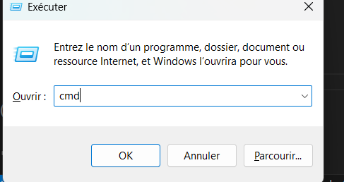
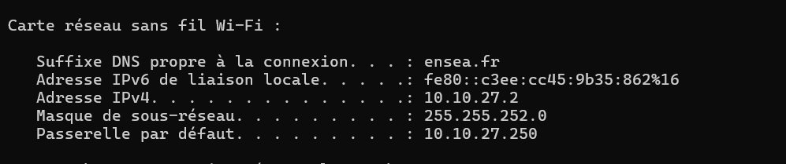
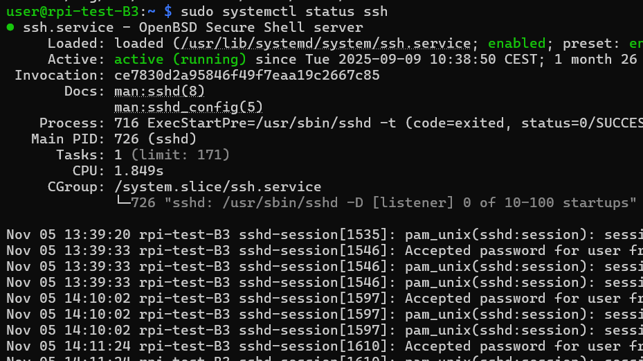

## TP 1
### objectif
* Configurer la Raspberry Pi Zero
* Un tutoriel pas a pas est mis en place pour vous aider à installer les fichiers de l'OS qui sont nécessaires au bon fonctionnement de la Raspberry Pi : 
  
   1. Flasher la carte SD 
   2. Activer la liaison UART
   3. Configurer la connexion 
   4. Se connecter en ssh via le Wifi
   5. Sécuriser la connexion ssh avec une clé 

#### Flasher la carte SD
Allez sur https://www.raspberrypi.com/software/ et installez la Raspberry selon votre type de PC (Winodws, MacOS).

Sélectionnez le bon modèle de RPI : Raspberry Pi Zero 2W

Sélectionnez l'OS adapté à notre utilisation : Raspberry Pi (other) -> L'OS Lite (32-bit)

Sélectionnez le support d'installation de l'OS, sélectionnez la carte SD 

Validez la configuration, la carte SD est prête à être flachée. Cliquez sur Next et choisissez "Edit settings" 

Modifiez quelques paramètres :
* Le hostname -> Choisir la forme "nom de la salle-tes initiales-initiales du binôme"
* nom d'utilisateur et un mot de passe (le mot de passe sera nécessaire à chaque fois donc à retenir)

Validez les modifications apportées et les appliquer a l'installation. 
Validez la copie de l'image de l'OS Linux sur la carte SD.

Le processus dure quelques minutes, la fichiers sont copiés et une vérifications de la copie a lieu.

une fois fini, retirez la carte SD et réinsérez la carte SD flachée. Ensuite, éjectez la carte SD en toute sécrité puis insérez la dans la Raspberry Pi.

Assurez vous que la Raspberry est bien allumée et connectée au réseau WIfi. 

Appuyez sur "Windows + R" et tapez "cmd" puis "Entrée"

Tapez, ensuite, "ipconfig"

cherchez la section correspendant au réseau Wifi appelée "carte réseau sans fil Wifi" 

Regardez la ligne "Passerelle par défaut..... : 'adresse ip'"
c'est l'adresse IP du routeur.

Allez sur internet et tapez sur la barre de recherche "http://192.168.65.1/#IP:DHCP_Server.Leases" en remplacant"192.168.65.1" par l'adresse IP de votre Wifi.

Regardez l'adresse IP de la Raspberry et la copier.

Ouvrez le terminal et tapez "ping 'adresse IP' "

si vous avez les mêmes réponses affichées à l'écran, ça veut dire que votre PC voit votre Raspberry sur le réseau donc la connection réseau fonctionne. (pour l'arrêter, tapez : "ctrl + C")

tapez "sudo systemctl status ssh"

Si vous voyez "active (running)" alors le SSH est déjà activé. 

Tapez "ssh user@adresse IP". Il vous demandera votre mot de passe (rien ne sera aficher pendant que vous écrirez, c'est normal)

S'il y a bien écrit "Linux rpi-test-B3 ...
Last login: Wed Nov  5 ..." alors vous êtes bien connecté à votre Rasberry via le SSH.

Allez sur VS code et cliquez sur le petit symbole en bleu en bas à gauche de l'écran.

Cliquez sur "Connect to host"

Mettez "votre nom d'utilisateur@l'adresse IP"

Il vous demandera sur quelle platefrome vous êtes (Linux, Windows ou MacOS), vous mettez "Linux"

Entrez votre mot de passe.
Revenez sur votre terminal et marquez "mkdir 'nom de votre dossier'" ensuite "cd 'nom de votre dossier'". Le dossier est creer, puis vous tapez "ls" puis "cd..".

Revenez sur VS code et ouvrez le dossier, créez, ensuite, 3 fichier "main.py" "MCP3208.py" et "votre composant.py" 

 

Maintenant il faudra rédiger un code dans les 3 onglets et les reliés ensemble pour que le code puisse fonctionner. 