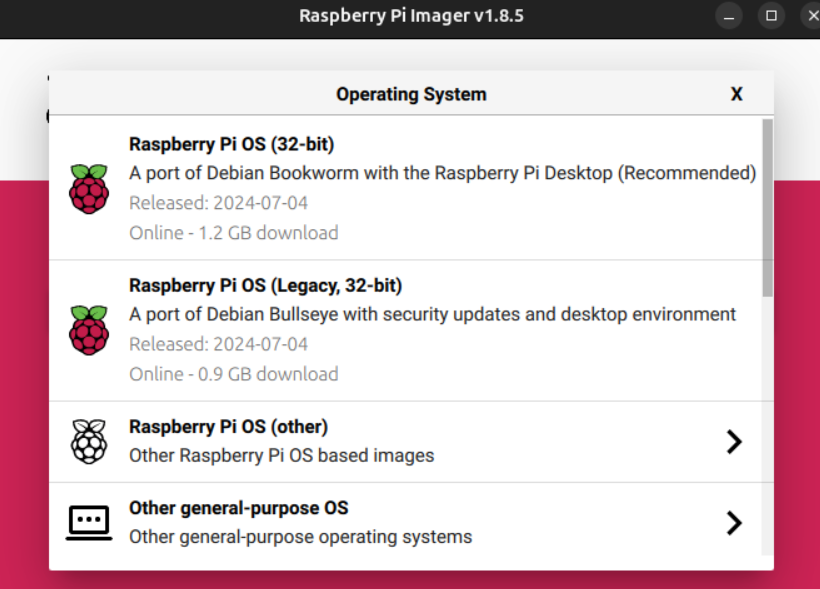
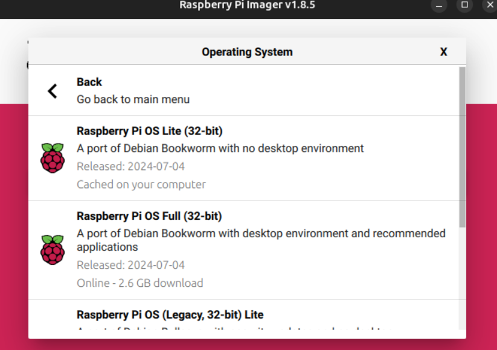
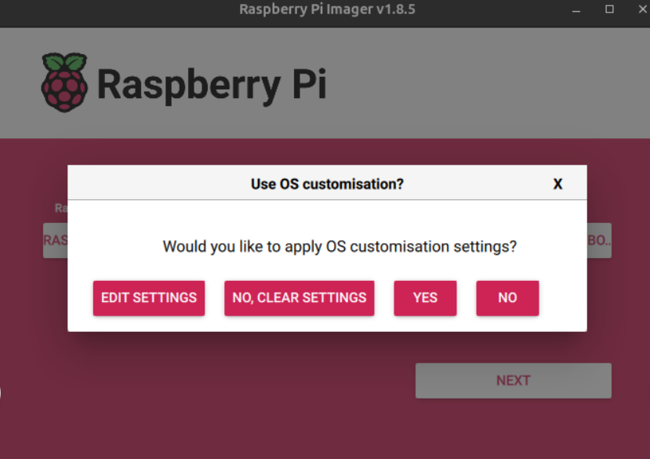
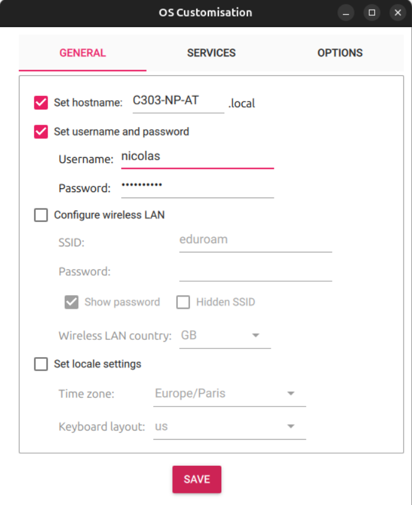
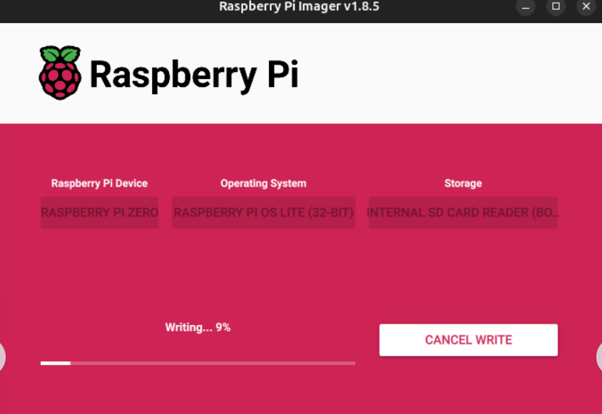
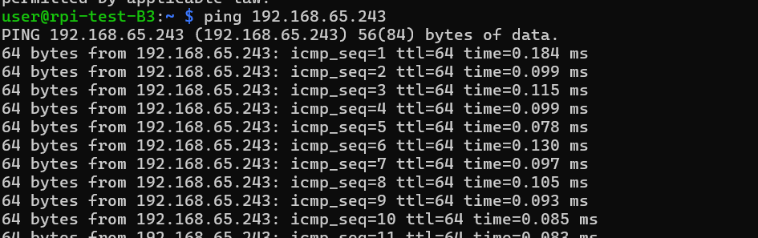
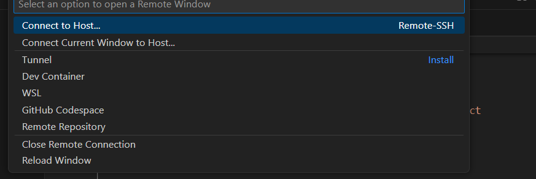
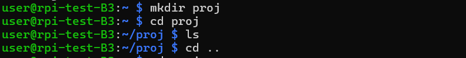

## TP 1
### Objectif
* Configurer la Raspberry Pi Zero 2W
* Un tutoriel pas a pas est mis en place pour vous aider à installer les fichiers de l'OS qui sont nécessaires au bon fonctionnement de la Raspberry Pi : 
  
   1. Flasher la carte SD 
   2. Activer la liaison UART
   3. Configurer la connexion 
   4. Se connecter en ssh via le Wifi
   5. Sécuriser la connexion ssh avec une clé 

#### Flasher la carte SD
**🛠️ Manipulation / code** Réalisez le flashage avec Raspberry Pi Imager en suivant les étapes ci-dessous.

Allez sur https://www.raspberrypi.com/software/ et installez Raspberry Pi Imager selon votre type de PC (Linux). Il est possible que le logiciel soit déjà installé dans la salle.


Sélectionnez le bon modèle de RPI : Raspberry Pi Zero 2W


Sélectionnez l'OS adapté à notre utilisation : Raspberry Pi (other) -> L'OS Lite (64-bit)





Sélectionnez le support d'installation de l'OS, sélectionnez la carte SD 


Validez la configuration, la carte SD est prête à être flashée. Cliquez sur Next et choisissez "Edit settings" 



Modifiez quelques paramètres :
* Le hostname : Choisir la forme <salle>-<initiales> (remplacer salle par la salle de TP et initiale par vos initiales)
* Nom d'utilisateur et un mot de passe (le mot de passe sera nécessaire à chaque connexion)
* Dans l'onglet « Services », activez SSH et l'authentification par mot de passe pour permettre la première connexion sans écran ni clavier.

**💭 Réflexion** Notez le hostname et le nom d'utilisateur choisis. Pourquoi est-il nécessaire de définir ces informations avant le premier démarrage d'une Raspberry Pi utilisée sans écran ?



Validez les modifications apportées et les appliquer a l'installation. 
Validez la copie de l'image de l'OS Linux sur la carte SD. La copie sur la carte SD nécessite les droits administrateurs que vous n'avez pas sur les postes de laboratoire. Appelez votre enseignant à cette étape.


Le processus dure quelques minutes, les fichiers sont copiés et une vérification de la copie a lieu.




Une fois fini, éjectez la carte SD en toute sécurité. Ne démarrez pas encore la Raspberry Pi.

#### Première connexion par UART
**📖 Lecture** L'UART est une liaison série asynchrone. Elle transmet les bits sans horloge commune, selon une vitesse et un format convenus entre l'émetteur et le récepteur. Dans ce TP, la console utilise `115200 bauds`, `8N1` et aucun contrôle de flux.

La liaison UART permet d'ouvrir une console locale sur la Raspberry Pi, sans utiliser le réseau. Elle sera utilisée pour le premier démarrage et la configuration du Wi-Fi.

**🛠️ Manipulation / code** Réinsérez la carte SD dans votre PC. Dans la partition `bootfs`, ouvrez le fichier `config.txt` et ajoutez la ligne suivante à la fin du fichier :

```text
enable_uart=1
```
Enregistrez le fichier, éjectez proprement la carte SD, puis insérez-la dans la Raspberry Pi.

Utilisez un adaptateur USB-UART en logique 3,3 V. N'utilisez pas d'adaptateur RS-232 et ne branchez pas la broche 5 V de l'adaptateur : ces tensions peuvent endommager la Raspberry Pi. Avec le connecteur GPIO de la Raspberry Pi Zero 2 W, branchez :

Les lignes TX et RX se croisent.

**💭 Réflexion** Sur votre compte rendu :

1. Expliquez pourquoi TX est relié à RX et RX à TX.
2. Expliquez le rôle de GND dans cette liaison.
3. Que signifie le réglage `115200 8N1` ?
4. Pourquoi ne faut-il pas connecter la broche 5 V de l'adaptateur aux GPIO de la Raspberry Pi ?
5. Que se passe-t-il si le terminal série est configuré à une autre vitesse que la Raspberry Pi ?
6. Dessinez un schéma de câblage représentant le sheild utiliser.

**Appeler votre professeur avant de brancher le câble USB** entre l'adaptateur USB-UART et votre PC. La Raspberry Pi démarre. Le premier démarrage peut prendre plusieurs minutes et afficher plusieurs séquences de démarrage.

Sur un PC Linux, si besoin, installez `minicom` :

```bash
sudo apt update
sudo apt install minicom -y
```

Repérez le port série créé par l'adaptateur avec :

```bash
sudo dmesg | grep -E 'ttyUSB|ttyACM'
```

Le port est souvent `/dev/ttyUSB0`, mais son nom peut être différent. Lancez ensuite la console série avec les paramètres `115200 bauds`, `8N1`, sans contrôle de flux :

```bash
minicom -D /dev/ttyUSB0 -b 115200
```

Adaptez `/dev/ttyUSB0` au port trouvé. Après les messages de démarrage, connectez-vous avec l'utilisateur et le mot de passe définis dans Raspberry Pi Imager. Pour quitter `minicom`, utilisez `Ctrl-A`, puis `X`.

Sur Windows, repérez le port COM de l'adaptateur dans le gestionnaire de périphériques et configurez PuTTY en mode `Serial`, avec une vitesse de `115200` bauds. Sur macOS, le périphérique est généralement nommé `/dev/cu.usbserial-xxxx`.

**💭 Réflexion** Comparez la connexion UART et la connexion SSH : quels équipements et quelles configurations sont nécessaires dans chaque cas ? Donnez un avantage et une limite de chaque méthode.

#### Configuration du Wi-Fi
**🛠️ Manipulation / code** Depuis la console UART, configurez le Wi-Fi et vérifiez l'adresse obtenue.
Depuis la console UART, lancez l'utilitaire de configuration :

```bash
sudo raspi-config
```

Sélectionnez `System Options` > `Wireless LAN`, saisissez le réseau `wifi-ensea` et laissez le mot de passe vide. Quittez le configurateur, puis vérifiez qu'une adresse IP a été attribuée :

```bash
ip a
```

Si l'erreur `S1 Wireless Lan error` apparaît, activez la radio Wi-Fi puis relancez `raspi-config` :

```bash
sudo nmcli radio wifi on
```

**💭 Réflexion** 
* Notez l'adresse IP obtenue.
* Avez vous accès à internet ?

Vous êtes à présent connecter au réseau 'wifi-ensea' mais n'avez pas de possibilité d'ouvrir le portail captif afin de saisir votre mot de passe. Nous devons nous mêmes envoyer ces informations pour débloquer la connexion.

Pour permette de vous connecter, il faut utiliser l'API fournie par la service ucopia qui est utilisé. Vous pouvez trouver la documentation sur internet ici (https://ucopia.com/wp-content/uploads/2016/07/Ucp_Portal_API_Guide.pdf).

Nous l'avons lu et fait des tests pour vous : il faut envoyer les informations suivante au serveur pour avoir accès à internet :

* URL : https://ucopia.ensea.fr/portal_api.php
* l'option "-X POST" : pour demander à curl d'envoyer des données au serveur et non pas seulement envoyer une requête pour recevoir une page web,
* Données :
   * authenticate : login
   * login : votre nom d'utilisateur (celui utilisé partout à l'école pour vous identifier)
   * password : votre mot de passe (celui utilisé partout à l'école pour vous identifier)
* User-Agent: Mozilla, c'est une instruction supplémentaire pour se faire passer pour un navigateur Mozilla, ceci est nécessaire pour que notre requête soit traitée.

```bash
curl -d @data.txt -X POST https://ucopia.ensea.fr/portal_api.php -H "User-Agent: Mozilla"
```

Afin de ne pas écrire l'identifiant et le mot de passe en clair dans la console et que n'importe qui puisse le relire avec la commande history (qui affiche toutes les commandes tapées depuis la création de votre compte), nous vous invitons à écrire ces données dans un fichier uniquement accessible par vous même :

```bash
nano data.txt
action=authenticate&login=<login>&password=<password>
```

Il est possible qu'au cours du TP vous n'ayez plus accès à internet car vous vous êtes fait déconnecté du réseau, un "timeout" trop faible est paramétré et si vous ne faites pas de requête web pendant un laps de temps, le routeur oublie votre authentification, pour palier à ce problème, il vous suffit de relancer la requête curl.
 
Remarque :
nano est un éditeur de texte en ligne de commande, il faut connaitre quelques raccourcis pour pouvoir l'utiliser :
```
Ctrl+S : pour sauvegarder vos modifications
Ctrl+X : pour quitter le logiciel
```

Lancer la requête précédemment proposée et analyser le retour du serveur ucopia.
Essayer de récupérer une page web sur internet (avec curl), le site perdu.com vous propose une page minimaliste et compréhensible sans avoir un navigateur avec une fenêtre pour afficher le fichier html et surtout afficher le code css (css = Cascading Style Sheets, correspond au code de mise en page des pages web, il est inexistant lorsque vous faites une requête avec curl).


#### Première connexion par SSH
**📖 Lecture** SSH fournit une connexion distante chiffrée. La première connexion avec un mot de passe sert ici à vérifier le réseau et à préparer l'authentification par clé.

**🛠️ Manipulation / code** Assurez-vous que la Raspberry est bien allumée et connectée au réseau Wifi Eduroam. 

<!-- Le réseau de la salle est géré par un routeur Mikrotik administré par le professeur : vous n'avez pas la main sur son interface d'administration, donc pas moyen d'aller y consulter la liste des baux DHCP vous-même. On utilise à la place le hostname mDNS que vous avez défini dans Raspberry Pi Imager, qui permet de joindre la Raspberry par son nom directement, sans connaître son adresse IP. -->

Ouvrez un terminal sur votre PC Linux et tapez "ping nom_de_votre_hostname.local" (remplacez "nom_de_votre_hostname" par le hostname choisi à l'étape de flash).



<!-- si vous avez des réponses affichées à l'écran, ça veut dire que votre PC voit votre Raspberry sur le réseau donc la connexion réseau fonctionne. (pour l'arrêter, tapez : "ctrl + C")

Si le ping ne répond pas (résolution mDNS parfois indisponible selon le PC), deux solutions de secours :
* scannez le sous-réseau avec nmap : "nmap -sn 192.168.X.0/24" (remplacez X par le sous-réseau de la salle) et repérez l'IP dont le nom d'hôte correspond au hostname choisi.
* demandez au professeur l'adresse IP attribuée à votre Raspberry sur le Mikrotik. -->

Tapez "ssh utilisateur@nom_de_votre_hostname.local" (ou "ssh utilisateur@adresse_ip" si vous êtes passés par la solution de secours). Il vous demandera votre mot de passe (rien ne sera affiché pendant que vous écrirez, c'est normal).


S'il y a bien écrit "Linux rpi-test-B3 ...
Last login: Wed Nov  5 ..." alors vous êtes bien connectés à votre Raspberry via SSH.

Allez sur VS code et cliquez sur le petit symbole en bleu en bas à gauche de l'écran.


Cliquez sur "Connect to host"



Mettez "votre nom d'utilisateur@nom_de_votre_hostname.local"


Il vous demandera sur quelle plateforme vous êtes (Linux, Windows ou MacOS), vous mettez "Linux"

Entrez votre mot de passe.
Revenez sur votre terminal et marquez `mkdir nom_de_votre_dossier`, puis `cd nom_de_votre_dossier`. Le dossier est créé. Vérifiez son contenu avec `ls`, puis revenez au dossier précédent avec `cd ..`.



Revenez sur VS Code et ouvrez ce dossier à distance. Créez un fichier `test.py` pour vérifier que l'espace de développement fonctionne correctement.


Les TP suivants utiliseront ce dossier pour organiser le code de chaque capteur ou actionneur.

#### Sécuriser SSH avec une clé
**📖 Lecture** Une paire de clés SSH contient :

* une **clé privée**, conservée uniquement sur votre PC et éventuellement protégée par une phrase secrète ;
* une **clé publique**, installée sur la Raspberry Pi dans `~/.ssh/authorized_keys`.

La clé publique peut être partagée. La clé privée ne doit jamais être envoyée à quelqu'un ni copiée sur la Raspberry Pi.

**🛠️ Manipulation / code** Depuis le terminal de votre PC, générez une paire de clés Ed25519 :

```bash
ssh-keygen -t ed25519 -C "pc-ensea"
```

Validez le chemin proposé, généralement `~/.ssh/id_ed25519`, puis choisissez une phrase secrète. Cette phrase secrète protège la clé privée si le fichier est récupéré.

Vérifiez que les deux fichiers ont été créés :

```bash
ls -l ~/.ssh/id_ed25519 ~/.ssh/id_ed25519.pub
```

Copiez ensuite la clé publique sur la Raspberry Pi, en remplaçant les deux noms entre chevrons :

```bash
ssh-copy-id <utilisateur>@<hostname>.local
```

La commande demande une dernière fois le mot de passe de la Raspberry Pi et ajoute la clé publique dans `~/.ssh/authorized_keys`. Si `ssh-copy-id` n'est pas disponible, utilisez la commande équivalente :

```bash
cat ~/.ssh/id_ed25519.pub | ssh <utilisateur>@<hostname>.local 'mkdir -p ~/.ssh && chmod 700 ~/.ssh && cat >> ~/.ssh/authorized_keys && chmod 600 ~/.ssh/authorized_keys'
```

Ouvrez une nouvelle connexion pour vérifier que la clé fonctionne :

```bash
ssh <utilisateur>@<hostname>.local
```

Si une phrase secrète a été définie, la demande affichée concerne la clé privée, et non le mot de passe du compte Raspberry Pi. Ne fermez pas la session UART ou SSH actuelle avant d'avoir validé cette nouvelle connexion.

**💭 Réflexion** Répondez aux questions suivantes :

1. Où se trouve la clé privée ? Où se trouve la clé publique ?
2. Pourquoi la clé privée ne doit-elle pas être copiée dans `~/.ssh/authorized_keys` ?
3. Quel est le rôle de `authorized_keys` ?
4. Quelle différence faites-vous entre le mot de passe du compte Raspberry Pi et la phrase secrète de la clé privée ?
5. Pourquoi faut-il tester une nouvelle connexion avant de désactiver l'authentification par mot de passe ?
6. Quels droits doivent avoir les dossiers et fichiers `.ssh` pour limiter les risques ?

**🛠️ Manipulation / code - optionnel** Une fois l'authentification par clé testée dans un second terminal, vérifiez l'état du serveur SSH :

```bash
sudo systemctl status ssh --no-pager
```

Ne désactivez pas l'authentification par mot de passe dans ce TP sans validation de l'enseignant : une erreur de clé ou de permissions pourrait vous empêcher de vous reconnecter.